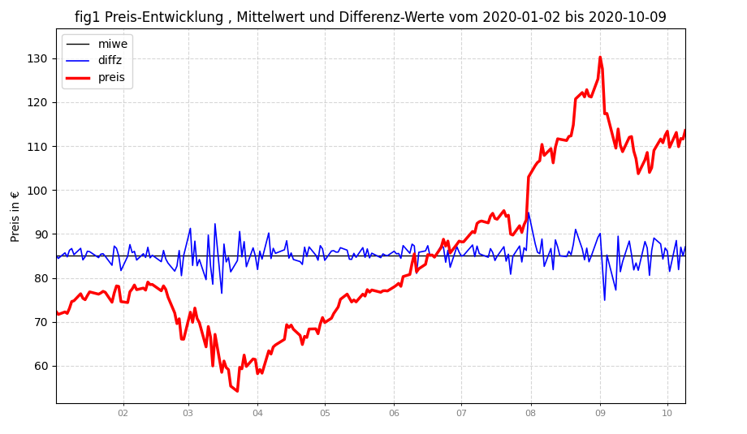
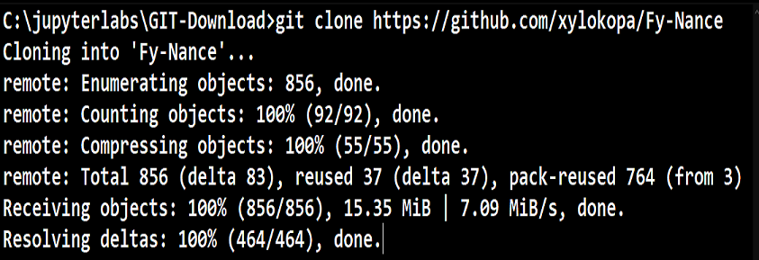

  <a href="LOCAL-README2.md" target="_blank">Zum Verzeichnis der restlichen Ticker-Daten im CSV-Format</a>

  
  

### 🛠️ Fy-Nance: Projekt-Komponenten in Reihenfolge der Download-Präferenz

| Komponente / Baustein | Typ | LINKE MAUSTASTE nur betrachten... | RECHTE MAUSTASTE Link speichern unter... | Beschreibung |
| :--- | :---: | :---: | :---: | :--- |
| **02Apple_Offline.csv** | `CSV` | [🧪](./02Apple_Offline.csv) | [📥](./02Apple_Offline.csv) | hier die Endung VON HAND auf .csv SETZEN ! |
| **Fliesenleger.ipynb** | `iPYNB` | [💀](./Fliesenleger.ipynb) | [📥](./Fliesenleger.ipynb) | Übungsbeispiel 1 jupyter Notebook|
| **AAPL_Beispiel.ipynb** | `iPYNB` | [💀](./AAPL_Beispiel.ipynb) | [📥](./AAPL_Beispiel.ipynb) | Übungsbeispiel 2 jupyter Notebook|
| **Notebook-Prerequisites** | `iPYNB` | [💀](./Notebook-prerequ.ipynb) | [📥](https://github.com/xylokopa/Fy-Nance/blob/main/Notebook-prerequ.ipynb) | jupyter Notebook Prerequisites|
| **BOszi_Projekt_prerequisites.py** | `PY` | [🧪](./Oszi_Projekt_prerequisites.py) | [📥](./BOszi_Projekt_prerequisites.py) | Testprogramm Python-Code |
| **Oszi_03n_290626.ipynb** | `iPYNB` | [💀](./Oszi_03n_01-07-26.ipynb) | [📥](./Oszi_03n_01-07-26.ipynb) | jupyter Notebook Hauptprogramm |
| **BOszi_Projekt.py** | `PY` | [🧪](./BOszi_Projekt.py) | [📥](./BOszi_Projekt.py) | Hauptprogramm Python-Code |
| **AAPL_Beispiel.py** | `PY` | [🧪](./AAPL_Beispiel.py) | [📥](./AAPL_Beispiel.py) | Übungsbeispiel Python-Code |
| **BILD-AUSSCHNITT** | `PNG` | [📺](./figur0-1.png) | [📥](./figur0-1.png?raw=true) | Screencopy wenn alles OK |
| **PROJEKT-OBERFLAECHE** | `PNG` | [📺](./250402-260618.png) | [📥](./main/250402-260618.png?raw=true) | Screencopy wenn alles OK |
| **WORTSCHATZ** | `PDF` | [👁️](./WORTSCHATZ.pdf) | Geöffnete PDF direkt herunterladen | PCA-Ressources PDF |
| **STATISTIK** | `PNG` | [📺](./STATISTICS.PNG) | [📥](./STATISTICS.PNG?raw=true) | Auswertungsbeispiel |
| **DISKUSSION** | `PDF` | [👁️](./KS-LI-SW.pdf) | Geöffnete PDF direkt herunterladen | MESS-ERGEBNISSE PDF |
| **BOszi_03.pdf** | `PDF` | [👁️](./BOszi_03.pdf) | Geöffnete PDF direkt herunterladen | Python-Script komplett-Doku PDF |
| **PCA-Dokumentation** | `PDF` | [👁️](./PCA-Data-ressources.pdf) | Geöffnete PDF direkt herunterladen | PCA-Ressources PDF |
| :--- | :---: | :---: | :---: | :--- |
| :--- | :---: | :---: | :---: | :--- |

  <a href="LOCAL-README2.md" target="_blank">Zum Verzeichnis der restlichen Ticker-Daten im CSV-Format</a>

